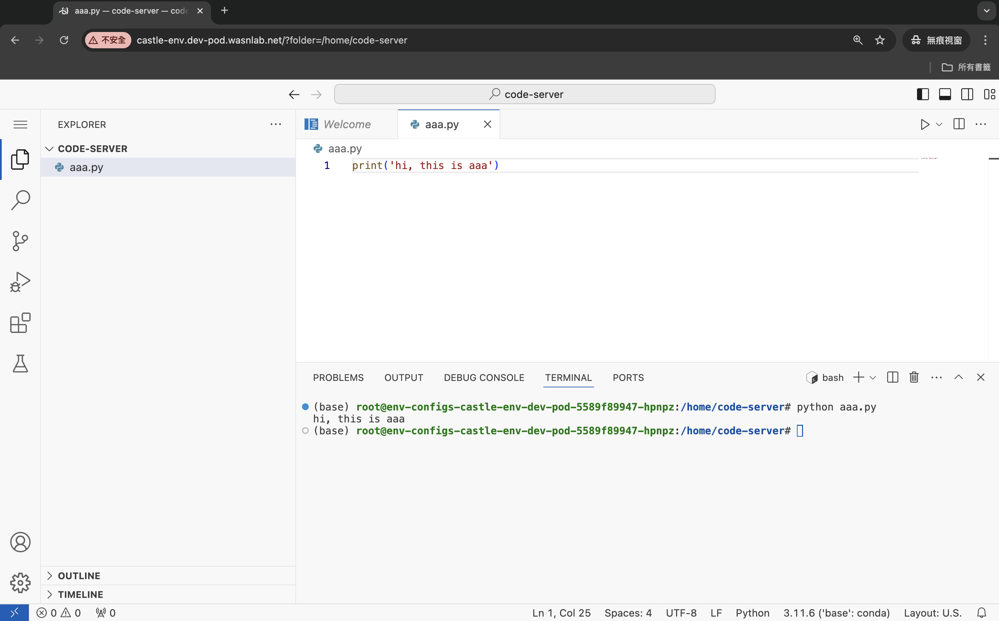
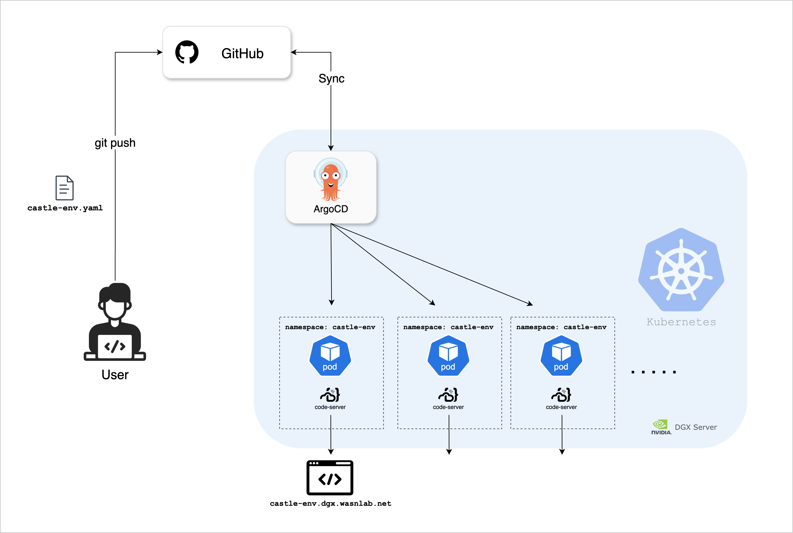
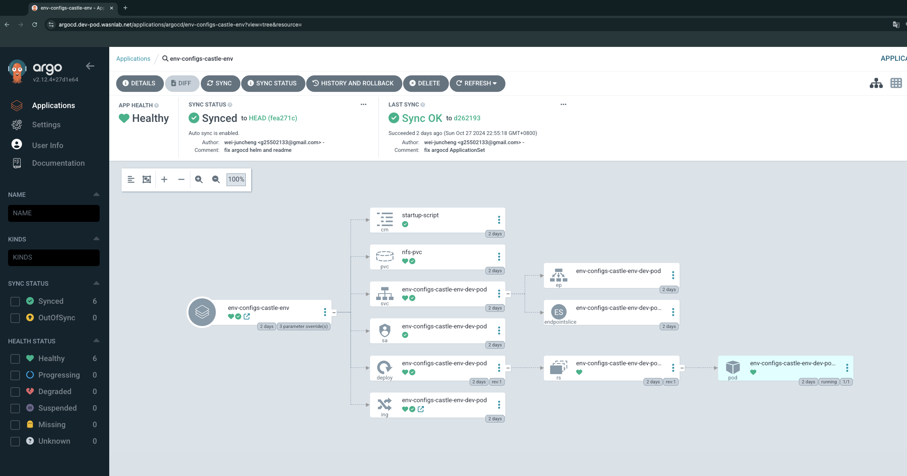

# DGX Dev Pod
[](https://github.com/wasn-lab/DGX_Dev_Pod/blob/main/README.md)
[](https://wasn.csie.ncu.edu.tw/)

### 隨開即用的開發環境


<!-- toc -->
- [What is DGX Dev Pod?](#what-is-dgx-dev-pod)
- [More About Dev Pod](#)
- [Getting Started](#getting-started)
    - [Prerequisite](#prerequisite)
    - [Creating Configuration File](#creating-configuration-file)
    - [Waiting for Deployment](#️waiting-for-deployment)
    - [Monitoring ArgoCD Deployment](#monitoring-argocd-deployment)
    - [Start Using](#start-using)
    - [Note](#️-note)
- [Update Your Environment](#update-your-environment)
<!-- tocstop -->

## What is DGX Dev Pod?
The DGX Dev Pod is a platform that allows WASN students to dynamically create development environments base on Kubernetes Pod. Students simply create their own configuration file, and ArgoCD will quickly set up a development environment that includes a [code-server](https://github.com/coder/code-server) based on the Docker image specified in the file.

## More About Dev Pod
Dev Pod utilizes [ArgoCD](https://argo-cd.readthedocs.io/en/stable/) and [Helm](https://helm.sh/) to establish an automated deployment flow.



## Getting Started
### Prerequisite
- 為了資安考量，這個系統目前只允許內網存取。請先連線至WASN實驗室內網
    - 你可以也透過實驗室VPN或連接WASN實驗室的Wifi

### 📝Creating Configuration File
- 請至DGX_Dev_Pod專案中的[env-configs/](/env-configs/)建立一份屬於你的環境設定檔
    - 為你自己的環境命名，例如：`castle-env`，我就創建檔案：`castle-env.yaml`
    - 你可以直接複製以下模板，並填入你的namespace、你需要使用的docker image名稱以及是否要使用GPU
      - ```
        # 你的名字
        createdBy: castle.cheng
        #-----------------------------

        # 請為你的kubernetes的namespace命名，用來分隔不同使用者的環境，這個名稱也會用於創建屬於你的domain name網址
        # 例如: castle-env 你的環境就會是 https://castle-env.dgx.wasnlab.net
        namespace: castle-env

        # 填入你開發環境內要使用的Docker image，需要填寫完整docker image name跟tag
        # 例如: jupyter/docker-stacks-foundation:latest
        docker_image: jupyter/docker-stacks-foundation:latest

        # 是否要使用GPU
        gpu_enabled: false

        ```

- 你可以直接在GitHub頁面上建立檔案，或是你將這個專案clone到你的電腦，再透過Git將你新建的設定檔推送到這個repositoy的main branch上

### ☕️Waiting for Deployment
- 建立好你的環境設定檔之後，等待3~5分鐘你專屬的環境就會建立完成
    - 這段時間會由[ArgoCD](https://argo-cd.readthedocs.io/en/stable/)讀取你剛剛建立的設定檔，並且透過[Helm](https://helm.sh/)在DGX的kubernetes cluster上創建你的namespace並下載你所需要的docker image，最後啟動[code-server](https://github.com/coder/code-server)，你就能透過瀏覽器直接連線到container內開發！
### 📊Monitoring ArgoCD Deployment
- 你也能透過GitHub登入ArgoCD的儀表板：https://argocd.dgx.wasnlab.net/ 確認你的環境是否成功建立或遇到任何錯誤訊息
    - 你能在這裡找到你的環境，用以確認所有Kubernetes元件的部署情況以及Pod的log
    - 命名規則是：`env-config-<你的namespace>`
    > 你登入的GitHub帳號必須要是[wasn-lab](https://github.com/wasn-lab)的`Members`或`Owner` team member才能看到ArgoCD的內容，你可以向WASN實驗室的管理員提出申請

    - 
    - 

### 🎉Start Using
- 請在瀏覽器輸入：`https://<你的環境名稱>.dgx.wasnlab.net`
    - `<你的環境名稱>`請換成你填寫在yaml檔裡`namespace`欄位的值（例如我的環境名稱是`castle-env`，那我的網址就是`https://castle-env.dgx.wasnlab.net`）
- 歡迎！
    - 

### ⚠️ Note
 - 這邊建立的開發環境是暫時的，將資料存放在`/home/code-server`預設目錄底下才會被妥善的保存，其餘環境例如：已安裝的python套件將會在Pod被重新建立時消失。 Pod可能會在你更改container image、GPU的設定有改動或系統更新時重建，因此強烈建議使用`requirements.txt`, [Poetry](https://python-poetry.org/)或其他套件管理工具來確保你開發所需要的套件是固定的
 - 使用太舊的container image來創造環境可能會讓code-server無法正常安裝，你將會在ArgoCD看到pod不斷的被重啟，請更換較新的container image或是跟管理員聯絡。如果你不知道該用什麼container image，你可以參考[env-configs](/env-configs/)中其他同學的設定
    - 目前確認可用的container image清單：
        - `hazdzz/dgx-torch:1.0.4`
        - `pytorch/pytorch:2.3.1-cuda12.1-cudnn8-runtime`

## Update Your Environment
- 如果你需要改用其他的Docker image作為開發環境，你可以直接修改你所創建的環境設定檔，重新git push之後就會驅動ArgoCD部署一個新的環境給你，大約需要等待5分鐘，你可以透過GitHub登入ArgoCD的儀表板：https://argocd.dgx.wasnlab.net/ 確認你的環境是否成功建立或遇到任何錯誤訊息
