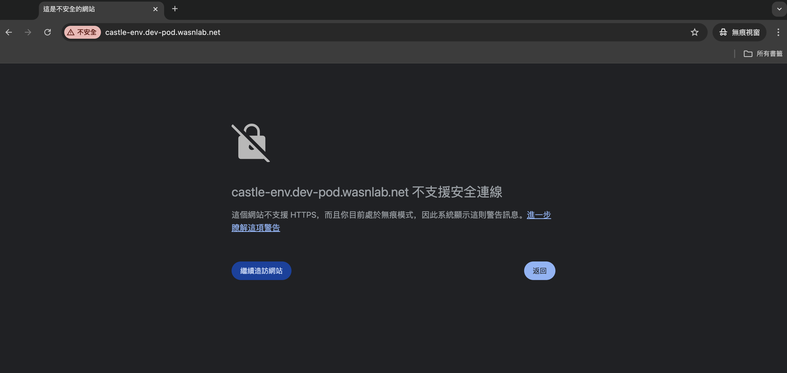
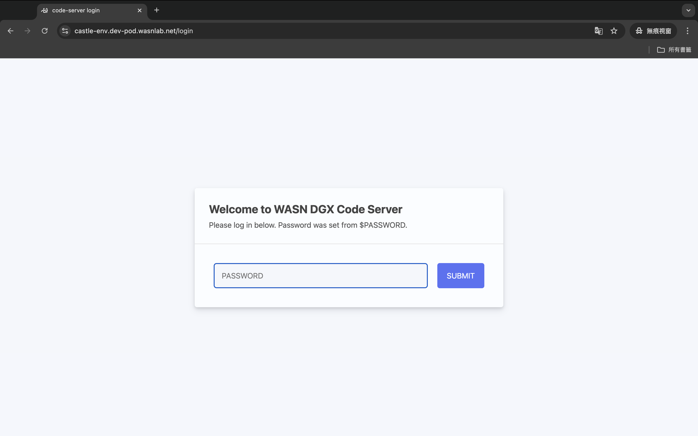
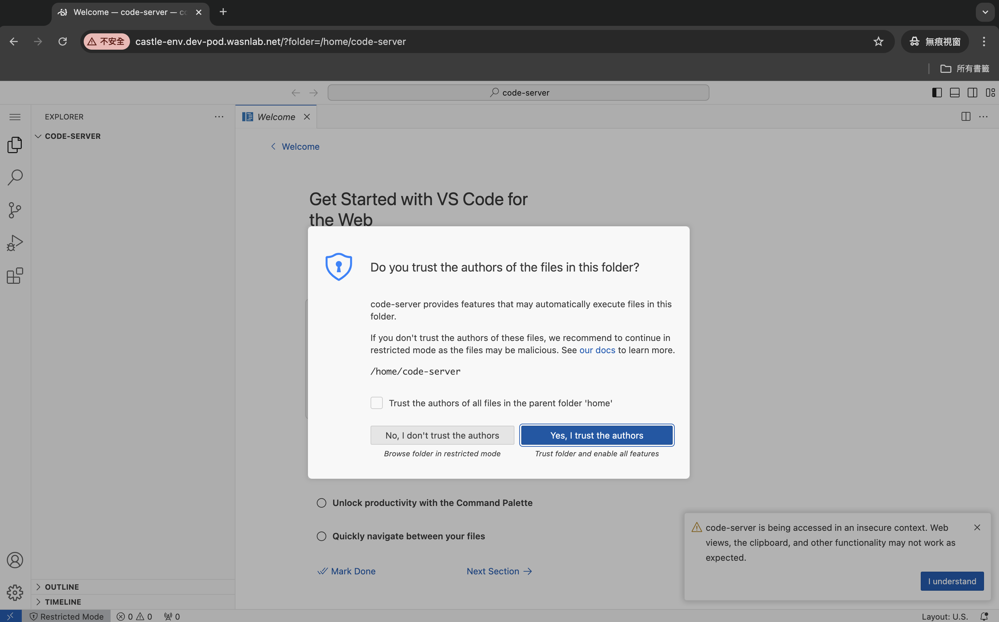
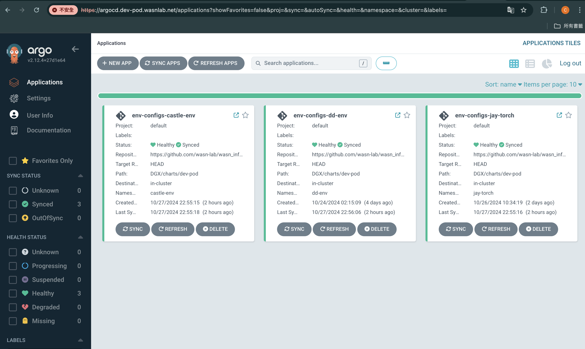

# DGX_Dev_Pod

隨開即用的開發環境

## 創建你的環境設定檔📝
- 請至DGX_Dev_Pod專案中的[env-configs/](/env-configs/)建立一份屬於你的環境設定檔
    - 為你自己的環境命名，例如：`castle-env`，我就創建檔案：`castle-env.yaml`
    - 你可以直接複製以下模板，並填入你的namespace、你需要使用的docker image名稱
      - ```
        # 你的名字
        createdBy: castle.cheng
        #-----------------------------

        # 請為你的kubernetes的namespace命名，用來分隔不同使用者的環境，這個名稱也會用於創建屬於你的domain name網址
        # 例如: cc-env 你的環境就會是 http://cc-env.dev-pod.wasnlab.net
        namespace: castle-env

        # 填入你開發環境內要使用的Docker image，需要填寫完整docker image name跟tag
        # 例如: jupyter/docker-stacks-foundation:latest
        docker_image: jupyter/docker-stacks-foundation:latest

        # 是否要使用GPU
        gpu_enabled: false

## 等待建立環境☕️
- 建立好你的環境設定檔之後，等待3~5分鐘你專屬的環境就會建立完成
    - 這段時間會由[ArgoCD](https://argo-cd.readthedocs.io/en/stable/)讀取你剛剛建立的設定檔，並且透過[Helm](https://helm.sh/)在DGX的kubernetes cluster上創建你的namespace並下載你所需要的docker image，最後啟動[code-server](https://github.com/coder/code-server)，你就能透過瀏覽器直接連線到container內開發！
## 開始使用🎉
- 請在瀏覽器輸入：`http://<你的環境名稱>.dev-pod.wasnlab.net`
    - `<你的環境名稱>`請換成你填寫在yaml檔裡`namespace`欄位的值（例如我的環境名稱是castle-env，那我的網址就是`http://cc-env.dev-pod.wasnlab.net`）
    - 由於現在我們還沒有使用HTTPS憑證，因此瀏覽器會顯示不安全（未來會加上憑證QQ）
    - 
- 輸入密碼：`wasn`
    - 
- 開始使用！
    - 
## 監控ArgoCD部署情況
- 透過ArgoCD的儀表板：https://argocd.dev-pod.wasnlab.net/
    - 